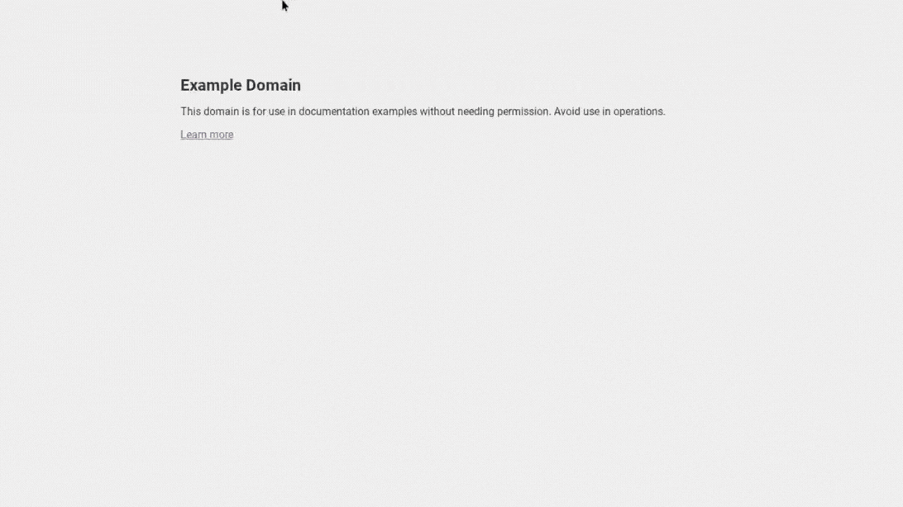

<head>

</head>

# The Daily Cosmos
A daily article about space for your newtab page.

## Demo

# [TRY HERE!](https://26097ek.github.io/DailyCosmos)

## What It Does
When you load the page, the website loads today's NASA article about space. It changes every day. Sometimes, instead of an image, NASA uploads a video. You can watch it here.

## Credits
+ PNG tree for the favicon
+ NASA for the API key and the article
+ [Get a free API key here!](https://api.nasa.gov)